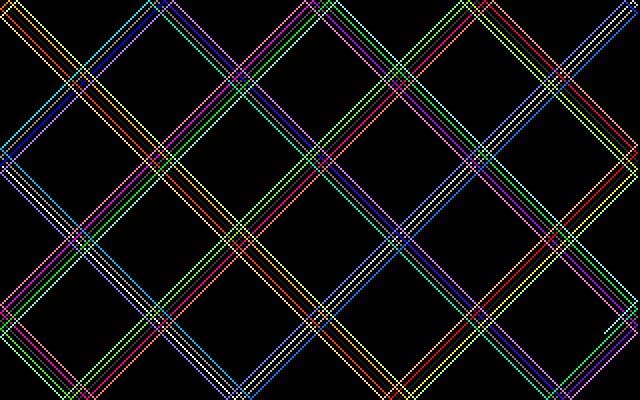
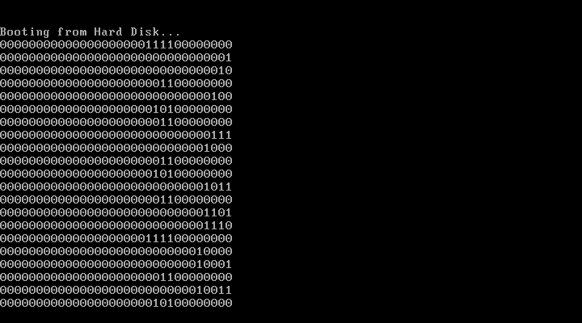

# Semestral work KIV/FJP
Minimalistic compiler from extended PL/0 to unreal mode x86 instructions

## Prerequisities
### Execution only
* JRE 1.8+
* qemu-system-i386 (highly recommended)
### For future development
* JDK 1.8+
* nasm
* objdump

# Instalation
For compilation use **build.sh**, it has two parameters, first is the
filename/path to the **pl0** source, second is output file (executable),
for example:

`./build.sh hilbert.pl0 out.bin`

This command creates the output program **out.bin**, which can be executed
with **run.sh** script:

`./run.sh out.bin`

This command opens **QEMU** emulator and runs the program.

The second option
to run this _program_ is run it on bare hardware, but it runs in unreal
mode which means it can potentially corrupt anything (filesystem etc.),
especially when we talk about compiled program, which can contain anything.
Running program on bare hardware is not recommended, should be done only by
advanced user and it is on your own risk.
If you still want to run it on bare HW, generated file (for instance `out.bin`)
is actually a OS image, which can be booted, so commands like `dd` can be
usefull.

	
	
	
	

